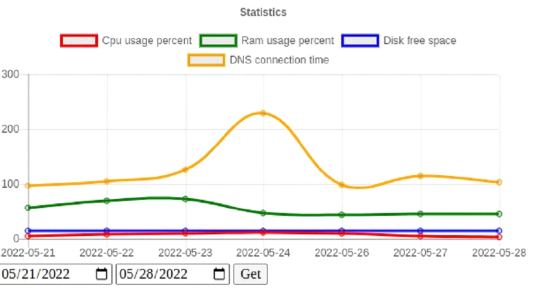

# ServerStatusCollector
> Collects and displays statistics on the use of system resources.
## Introduction
This application was written as part of a course on developing applications in java.
## Dependencies

<ul>
<li>OpenJDK-8</li>
<li>Maven</li>
</ul>

## Usage
Clone repository:

```sh
git clone https://github.com/thekravchan/ServerStatusCollector
```

Run the programm:

### MacOS/Linux:

```sh
./mvnw spring-boot:run
```

### Windows:

```sh
mvnw spring-boot:run
```

## Preview

